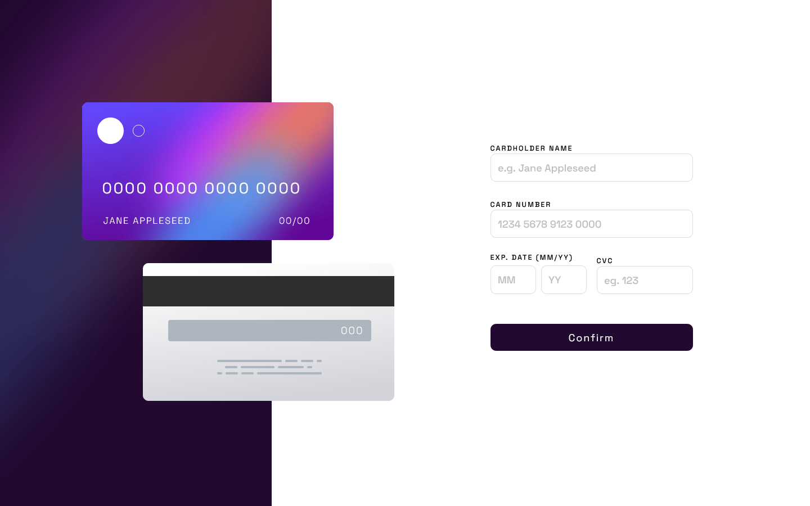
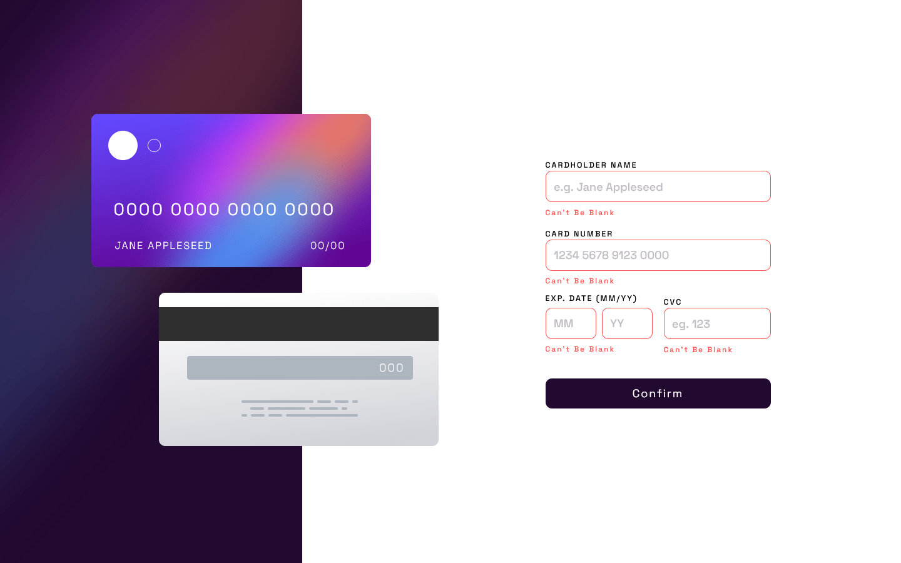
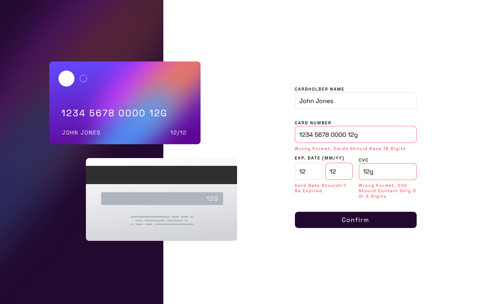
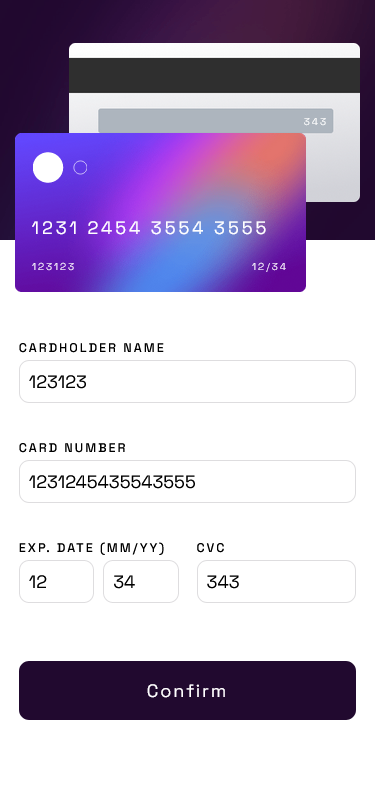
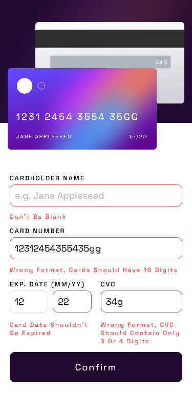

!!!!IMPORTANT!!!!

This project was done using 
- 1440px x 900px for Desktop
- 375px x 812px for Mobile

It is not responsive so please be sure to keep that in mind when looking at it adjust the dimensions or it won't display properly

# Frontend Mentor - Interactive card details form solution

This is a solution to the [Interactive card details form challenge on Frontend Mentor](https://www.frontendmentor.io/challenges/interactive-card-details-form-XpS8cKZDWw). Frontend Mentor challenges help you improve your coding skills by building realistic projects. 

## Table of contents

  - [Screenshot](#screenshot)
  - [Links](#links)
- [My process](#my-process)
  - [Built with](#built-with)
  - [What I learned](#what-i-learned)
  - [Continued development](#continued-development)
  - [Useful resources](#useful-resources)
- [Author](#author)
- [Acknowledgments](#acknowledgments)


### Screenshot









### Links

- Solution URL: [GitHub](https://github.com/TheGroobi/Interactive-Card-Details-Form-Main)
- Live Site URL: [Vercel](https://interactive-card-details-form-main-sable.vercel.app/)

## My process
This project was way above my current skill level when i started it, or i might have just made it hard for myself for no apparent reason.
I started like always with html css which was a bit of a struggle but nothing too bad yet, until i stumbled upon the double inputs for Month and Year, i started looking for answers online if there is inputs for month or year alone but didn't find anything. So i stuck with two number inputs and one label(which i know is not viable for accessibility but not really sure how to fix it and i don't plan on doing that rn). Also i struggled with aligning the inputs so i decided to use grid which i still wasn't that good at, and i ended up changing it like 3/4 times throughout the whole proccess. Next big thing i had issue with was the errors with js. Oh man that alone took me like 3 days to finish with the help of a friend in the field, and googling at least 400 articles. Countless hours later i managed to implement everything i wanted to and still made it somewhat of a decent looking code (for my knowledge right now ofc). There is still sone issues with it which i will explain in [Continued development](#continued-development), but at this point im proud of myself and the code i managed to write.

### Built with

- Semantic HTML5 markup
- CSS custom properties
- Flexbox
- CSS Grid
- [Sass](https://sass-lang.com/)
- JavaScript

### What I learned

I learned a whole lot of useful things because of this but the main ones i remember are: 
- Further knowledge on CSS Grid (I feel pretty comfortable with it now)
- JS Objects (values, keys selecting and using them)
- JS forEach() loops
- JS if statements
- using Regex's (still not the best, but somewhat usable skill atp)
- JS Using input values for functions and statements (half of my code depends on checking the inputs)
- Knowledge on validation and adding errors
- Sass (basic knowledge and implementation of mixins, variables, nesting) still not sure if i like it better than vanilla css

Here is the main thing im proud of the JS function below:

```js
function MySweatAndTears(e) {
    let hasError = false;
    if (!hasError) {
        inputsObject.forEach(inputObject => {
            const inputError = inputObject.input.parentElement.lastElementChild;
            inputError.textContent = "";
            inputObject.input.classList.remove('error-border');
        });
        inputsObject.forEach(inputObject => {
            let input = inputObject.input;
            const inputError = input.parentElement.lastElementChild;
            if (!input.value.length) {
                e.preventDefault();
                inputError.textContent = "Can't be blank";
                input.classList.add('error-border');
                hasError = true;
            } else if (inputObject.requirement) {
                e.preventDefault();
                if (inputObject.requirement === 'card') {
                     if (!cardNumberPattern.test(input.value)) {
                        inputError.textContent = "Wrong format, cards should have 16 digits"
                        input.classList.add('error-border');
                        hasError = true;
                    }
                } else if (inputObject.requirement === 'month' || inputObject.requirement === 'year') {
                    if (!datePattern.test(input.value)) {
                        inputError.textContent = "Card date should be in MM/YY format"
                        input.classList.add('error-border');
                        hasError = true;
                    } else if (inputObject.requirement === 'year') {
                        if (input.value < (thisYear - 20)) {
                            inputError.textContent = "Card date shouldn't be expired"
                            input.classList.add('error-border');
                            hasError = true;
                        }
                    }
                } else if (inputObject.requirement === 'cvc') {
                    if (!cvcPattern.test(input.value)) {
                        inputError.textContent = "Wrong format, CVC should contain only 3 or 4 digits"
                        input.classList.add('error-border');
                        hasError = true;
                    }
                }
            }
        });
    }
    if(!hasError) {
    form.style.display = "none";
    completeContainer.style.display = "flex";
    }
    hasError = false;
};
```

And this little button animation with Sass
```scss
button {
    background: $darkViolet;
    border: none;
    color: white;
    padding: 1em;
    border-radius: 10px;
    font-size: 18px;
    grid-column: 1 / 5;
    grid-row: 4;
    letter-spacing: 2px;
    align-self: center;
    &:hover, &:focus {
        background: $darkVioletActive;
        color: $white;
        cursor: pointer;
        letter-spacing: 3px;
        transform: translateY(-5px);
        transition: all 0.2s ease-out;
    }
    &:active {
        background: $darkViolet;
        letter-spacing: 20px;
        transition: all 0.1s ease-out;
    }
}
```

### Continued development

Some things which are not completely finishined on this projects are responsive design, kind of neglected it i don't really want to do it right now, maybe i'll come back to it someday.
The cvc input and the number input are not perfect:

- cvc accepts if you put 3 numbers and one different character
- the number input checks if there are 16 numbers of 4 segments of 4 numbers and 3 spaces, but will accept the input if you put in 16 numbers + anything after (still not sure how to use regex to fix this)

Other than that i feel like this project has taught me a lot but gave me some kind of reality check that there is still so much more to learn and i know pretty much nothing right now. 
I'm still committed tho and will keep trying, maybe in 5 years i'll come back here and laugh at my stupidity and thought process. 
I want to do one more project with only sass and vanilla js, and the next one i might try learning some tailwind, it looked really fun to use. 

### Useful resources

- [Regex Creator](https://regexr.com/) - Very good site for understanding what your regex does and learning all the syntax.
  
Im not going to list the rest of the sites, cause i don't want to put in 400 links here and spam it out lmao, 
mainly used StackOverflow, mdn, w3schools, some random articles online, Scrimba 

## Author

- Frontend Mentor - [@thegroobi](https://www.frontendmentor.io/profile/thegroobi)
- Twitter - [@thegroobi](https://twitter.com/TheGroobi) (Don't really use that too often)

## Acknowledgments

Special thanks to Jarma, who mentored me through this project and checked my spaghetti code to make it better.
